# Agenda App

Aplicación de gestión de agenda desarrollada en Java como proyecto grupal.

La aplicación permitirá gestionar tareas, notas y eventos desde consola, aplicando una arquitectura organizada por funcionalidades y diferentes patrones de diseño.

## Tecnologías utilizadas

- Java 25
- Maven
- MySQL 8
- JDBC
- Docker
- Docker Compose
- JUnit 6
- Git
- GitHub

## Requisitos previos

Para ejecutar el proyecto es necesario disponer de:

- Java 25
- Maven
- Docker y Docker Compose
- Git

## Configuración

El proyecto utiliza variables de entorno para configurar la conexión con MySQL.

Crear el archivo `.env` a partir del archivo de ejemplo:

### Windows PowerShell

```powershell
Copy-Item .env.example .env
```

### Terminal Mac
```terminal
cp .env.example .env
```

### IntelliJ IDEA

- Abrir el proyecto como proyecto Maven utilizando `pom.xml`.
- Usar JDK 25 y Language Level 25.
- Si Maven no se detecta automáticamente, hacer clic derecho sobre `pom.xml` → `Add as Maven Project`.

Para ejecutar los tests de conexión a MySQL desde IntelliJ, configurar estas variables de entorno en la Run Configuration:

DB_HOST=localhost
DB_PORT=3306
DB_NAME=agenda-app-database
DB_USER=root
DB_PASSWORD=<password definido en .env>

## UML
