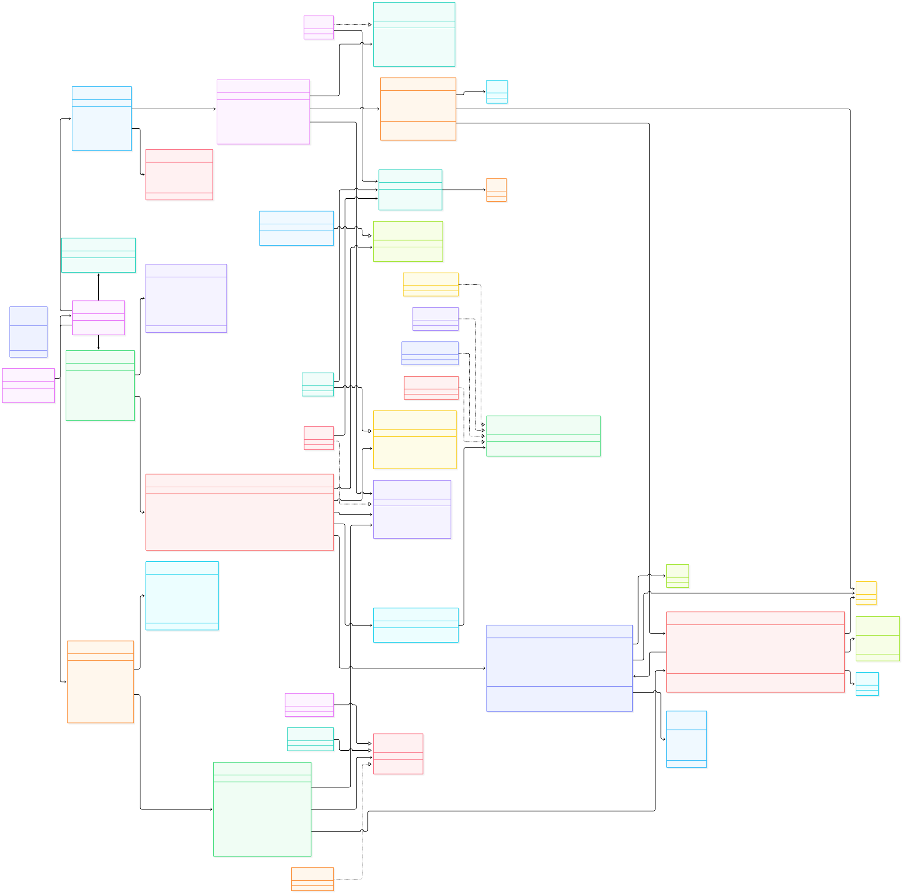

# Agenda App

Aplicación de gestión de agenda desarrollada en Java como proyecto grupal.

La aplicación permitirá gestionar tareas, notas y eventos desde consola, aplicando una arquitectura organizada por funcionalidades y diferentes patrones de diseño.

## Tecnologías utilizadas

- Java 25
- Maven
- MySQL 8
- JDBC
- Docker
- Docker Compose
- JUnit 6
- Git
- GitHub

## Requisitos previos

Para ejecutar el proyecto es necesario disponer de:

- Java 25
- Maven
- Docker y Docker Compose
- Git

## Configuración

El proyecto utiliza variables de entorno para configurar la conexión con MySQL.

Crear el archivo `.env` a partir del archivo de ejemplo:

### Windows PowerShell

```powershell
Copy-Item .env.example .env
```

### Terminal Mac
```terminal
cp .env.example .env
```

## Inicializar la base de datos

Una vez levantados los contenedores con Docker, es necesario ejecutar el script `agenda-app-db.sql` para crear las tablas de la aplicación dentro de MySQL.

Los siguientes comandos funcionan tanto en Windows PowerShell como en Terminal de macOS.

Desde la raíz del proyecto, copiar el archivo SQL al contenedor de MySQL:

```bash
docker cp agenda-app-db.sql mysql-agenda-app-container:/tmp/agenda-app-db.sql
```

Ejecutar el script dentro del contenedor:

```bash
docker exec mysql-agenda-app-container sh -c 'mysql -uroot -p"$MYSQL_ROOT_PASSWORD" < /tmp/agenda-app-db.sql'
```

Para comprobar que las tablas se han creado correctamente:

```bash
docker exec mysql-agenda-app-container sh -c 'mysql -uroot -p"$MYSQL_ROOT_PASSWORD" -e "USE \`agenda-app-database\`; SHOW TABLES;"'
```

El resultado debe mostrar las siguientes tablas:

```text
event
note
task
```

> [!NOTE]
> MySQL puede mostrar el aviso `Using a password on the command line interface can be insecure.` al ejecutar estos comandos. Es únicamente un warning y no impide la ejecución del script.

### IntelliJ IDEA

- Abrir el proyecto como proyecto Maven utilizando `pom.xml`.
- Usar JDK 25 y Language Level 25.
- Si Maven no se detecta automáticamente, hacer clic derecho sobre `pom.xml` → `Add as Maven Project`.

Para ejecutar los tests de conexión a MySQL desde IntelliJ, configurar estas variables de entorno en la Run Configuration:

DB_HOST=localhost
DB_PORT=3306
DB_NAME=agenda-app-database
DB_USER=root
DB_PASSWORD=<password definido en .env>

## UML
